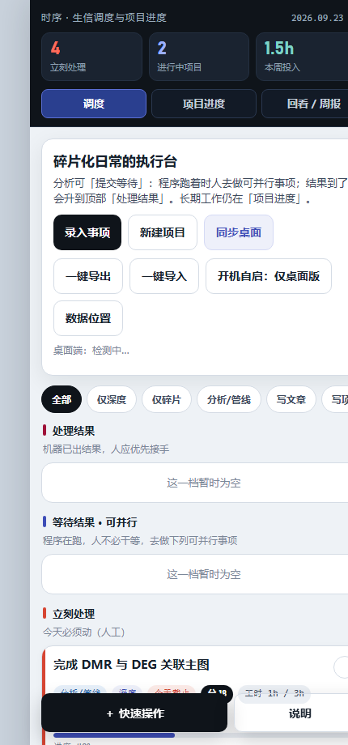
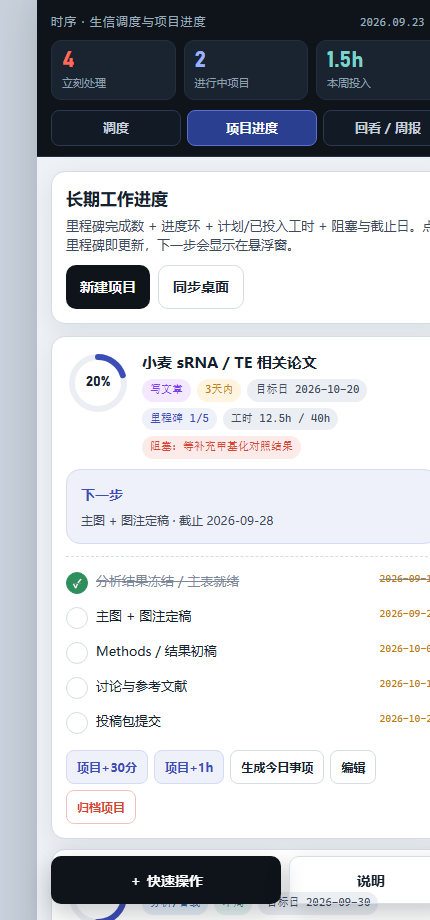
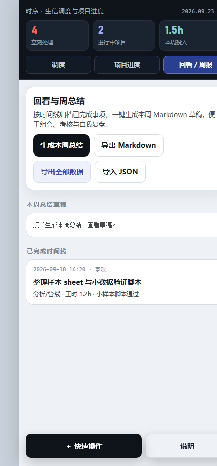
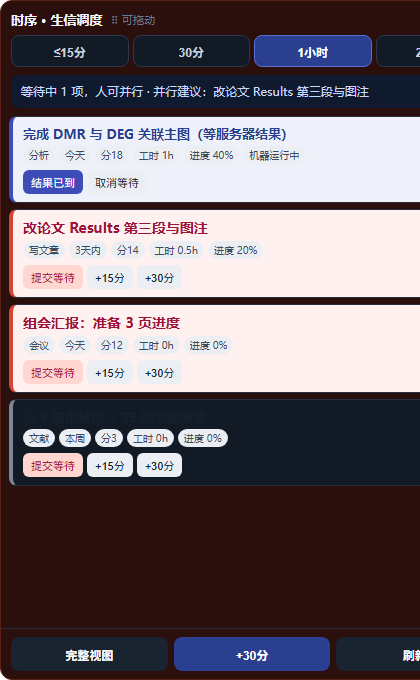
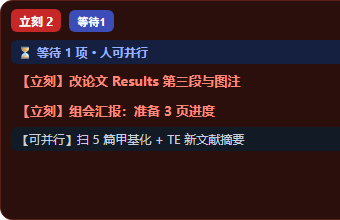

# 时序调度 · Shixu Desktop

**Windows / macOS 桌面效率工具**：帮你排清「今天先做什么」，并跟踪长期项目进度。

适合分析、科研、写作、项目等多线工作：任务容易碎片化，既要推进深度工作，又要处理会议、沟通与等待程序出结果的空档。

[](../../releases)
[](./LICENSE)

---

## 界面预览

| 主窗口 · 调度 | 主窗口 · 项目进度 |
|:---:|:---:|
|  |  |

| 主窗口 · 回看 / 周报 | 置顶悬浮窗（展开） |
|:---:|:---:|
|  |  |

<div align="center">

**收起状态的悬浮窗**（点击展开，可拖动到任意位置）



</div>

> 截图为示例数据界面（分析 / 论文 / 会议等），便于理解操作路径；安装后数据在你本机。

---

## 为什么需要它

| 常见困境 | 时序怎么帮 |
|----------|------------|
| 待办很多，不知道先做哪件 | 按截止日、后果、是否深度工作自动分档：立刻 / 今日 / 本周 / 可延后 |
| 长期论文、课题进度说不清 | 项目 + 里程碑，进度环一眼可见，标出「下一步」 |
| 分析程序在跑，人干等 | 「提交等待 → 可并行 → 结果已到」，机器跑机器的，人做人该做的 |
| 周五想复盘却凑不齐内容 | 完成事项自动进时间线，一键生成周报 Markdown |
| 切窗口时看不到优先级 | 置顶悬浮窗：收起看摘要，点击展开 |

---

## 界面与操作

### 1. 调度（主窗口）


1. **录入事项** 或 **一键导入** JSON  
2. 选择当前可用连续时间（≤15 分 / 30 分 / 1 小时 / 2 小时+）  
3. 在「立刻处理 / 待深度块 / 等待结果」中开工  
4. 快捷记工时：+15 分 / +30 分 / +1 小时  
5. 分析类任务可点 **提交等待**；结果好了点 **结果已到**

### 2. 项目进度（长期工作）


- 进度环 = 里程碑完成比例  
- 显示计划工时 vs 已投入、阻塞、目标日  
- 高亮 **下一步**，可一键 **生成今日事项** 进调度

### 3. 回看 / 周报


- 已完成事项时间线  
- **生成本周总结** → Markdown 草稿  
- 导出 / 导入 JSON，便于备份与换机

### 4. 置顶悬浮窗

| 收起 | 展开 |
|:---:|:---:|
|  |  |

- 拖动移动位置；**点击**展开（不因悬停误展开）  
- 可并行推荐、等待中任务、快捷记工时  
- 托盘菜单：打开主界面 / 导入导出 / 退出

---

## 下载安装

前往 **[Releases](../../releases)**：

### Windows

| 包 | 说明 |
|----|------|
| `时序调度-Setup-x.x.x.exe` | 正式安装包（推荐） |
| `shixu-Portable.zip` | 绿色版 |

Windows 10 / 11（64 位）。未签名时 SmartScreen：**更多信息 → 仍要运行**。

### macOS

| 包 | 说明 |
|----|------|
| `Shixu-Desktop-x.x.x-mac-arm64.dmg` | Apple Silicon（M 系列） |
| `Shixu-Desktop-x.x.x-mac-x64.dmg` | Intel |
| 对应 `.zip` | 免安装压缩包 |

macOS 11+。未公证时首次：右键 App → **打开**（不要直接双击）。

数据路径：

- Windows：`%APPDATA%\时序调度\shixu-data.json`
- macOS：`~/Library/Application Support/时序调度/shixu-data.json`

---

## 从源码运行

```bash
git clone https://github.com/Einstein-life/shixu-desktop.git
cd shixu-desktop
npm install
npm start
```

需要 Node.js 20+。网络较慢可用镜像：

```bash
export ELECTRON_MIRROR=https://npmmirror.com/mirrors/electron/
export ELECTRON_BUILDER_BINARIES_MIRROR=https://npmmirror.com/mirrors/electron-builder-binaries/
npm install
```

---

## 打包

```bash
# Windows
python scripts/sync_and_fix.py
npm run dist:win

# macOS（需在 macOS 上）
node scripts/make-icns.js
npm run dist:mac
```

推送 `v*` 标签后，GitHub Actions 会自动构建 Windows + macOS 并挂到 Release。

```bash
git tag v1.1.0
git push origin v1.1.0
```

更新文档截图（需本机 Chrome）：

```bash
python scripts/capture-docs-shots.py
```

---

## 项目结构

```text
electron/       主进程：窗口、托盘、自启、导入导出
renderer/       主窗口 + 悬浮窗
docs/images/    README 界面截图
assets/         图标
scripts/        打包 / 图标 / 截图脚本
```

---

## 隐私

任务、项目、周报仅存本机；导入导出由你手动触发；不收集使用数据。

---

## License

[MIT](./LICENSE) © 时序调度 contributors
